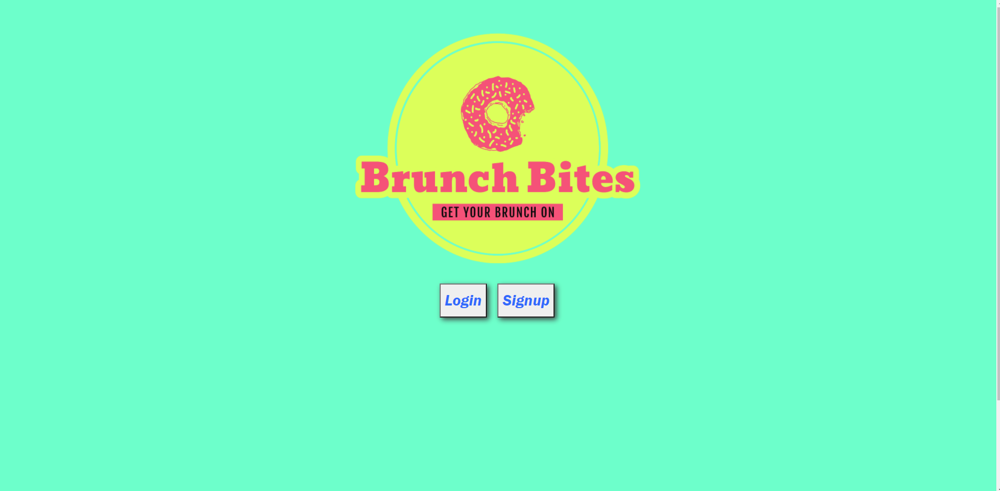

# Brunch Bites

## Table of Contents

- [Description](#Description)
- [User Story](#User-Story)
- [Resources](#Resources)
- [Contributors](#Contributors)

## Deployed Site and Screenshot

### https://brunch-bites.herokuapp.com/

#

#

## Description

Brunch Bites is a react application designed to make life easier for anyone who enjoys or goes to brunch.

## User-Story:

- When a user open the website
  - Then they are presented with sign-up/login options
- When one of those buttons is pressed
  - Then the user is prompted fill out the sign-up or login form
- When the user signs-up or logs in
  - Then they are taken to their profile page where, if populated, will be able to view their list of places "to visit" and place "visited" with information on the brunch places listed
- When the user wants to search for a new brunch place
  - Then they click a button that will take them to the search page
- When the user searches by city for a new brunch place
  - Then the user is provided a list of 20 brunch places within that city
- When the user clicks "add to watch list"
  - Then the brunch location is added to their profile and will be displayed in the "to visit" list
- When the user goes to a brunch spot in their "to visit" list and click the "add to visited" button
  - Then the brunch location is will be removed from their "to visit" list and be displayed in their "visited" list where they will be able to add a custom rating to the location
- When the user wants to remove a location from either list on their profile page
  - Then they click a button on the card which will remove it from the list it was inside

## Resources:

- React
- Mongoose
- MongoDB Atlas
- Deployed with Heroku
- BootStrap

## Contributors

- Checkout our github for further information on the application as well as our other work!
- Feel free to reach out with questions, concerns, or just to chat at our respective emails

Phalen:

- [Phalen's Github](https://github.com/PhalenH)
- Email Phalen at: pchaze@yahoo.com

Sam Kennedy:

- [Sam's Github](https://github.com/kennedysam168)
- Email Sam at: kennedysam168@gmail.com

Kieran Harris:

- [Kieran's Github](https://github.com/kieranh971)
- Email Kieran at: kharris19063@gmail.com

Christian Gleason:

- [Christian's Github](https://github.com/ChristianAnti)
- Email Christian at: christian.gleason416@gmail.com
